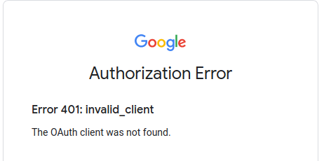

# AC-NH-TURNIP-PRICES-WITH-FRIENDS
_AKA [turnipprophet.io](https://github.com/mikebryant/ac-nh-turnip-prices) with 'friend support'_

## Get Started

### Initialize Submodules
```console
git submodule --init --recursive
```

### Build and Run
The project comes with the maven wrapper. To build the project:
```console
./mvnw clean package
```
Or if you're running Windows:
```powershell
mvnw.bat clean package
```

A runnable jar will be plopped in `./target`. To run it, assuming Java 1.8+ is installed on the system:
```console
java -jar ./target/ac-nh-turnip-prices-with-friends-<version>.jar
```

### Build and Run using Docker
Alternatively, the application can be built and run using the provided `./Dockerfile` (Requires... [Docker](https://docs.docker.com/get-docker/))

```console
docker build -t turnips-with-friends:latest . && docker run -it -p 8080:8080 turnips-with-friends:latest
```

### Running for the first time

At this, a working version of turnipprophet.io should be served on http://localhost:8080. Everything should be fine, but you'll notice when attempting to login with Google that you receive the following error:



This is because in order to authenticate with Google, your application needs Google API credentials setup.

#### Setup Google OAuth2
Start [here](https://developers.google.com/identity/protocols/oauth2/openid-connect) with steps **Obtain OAuth 2.0 credentials** and **Set a redirect URI**. Your redirect URI will most likely be `http://localhost:8080/login/oauth2/code/google`

Modify the [`application.properties`](ac-nh-turnip-prices-with-friends/src/main/resources/application.properties) with your application id and secret:
```console
spring.security.oauth2.client.registration.google.client-id=changeme
spring.security.oauth2.client.registration.google.client-secret=changeme
```

Now when you build, your Google credentials will be bundled inside the JAR that Docker creates. Which is probably a bad idea...

#### Setup Google OAuth2 - a better way
Spring Boot has [lots](https://docs.spring.io/spring-boot/docs/current/reference/html/spring-boot-features.html#boot-features-external-config) of ways to provide configuration. The recommended way for this project is to create your own `./application-secrets.properties` file and run the jar with the `secrets` profile:
```console
java -jar -Dspring.profiles.active=secrets ./target/ac-nh-turnip-prices-with-friends-0.0.1-SNAPSHOT.jar
```

#### Setup Google OAuth2 - a better way (with Docker)
Rather than modifying the default [`application.properties`](ac-nh-turnip-prices-with-friends/src/main/resources/application.properties) file, you can provide your own with a Docker [volume](https://docs.docker.com/storage/volumes/):
```console
docker run -it -p 8080:8080 -v /your/path/to/application.properties:/usr/src/app/application.properties turnips-with-friends:latest
```

##### Special Thanks
Special thanks to [Mike Bryant](https://github.com/mikebryant) and his [ac-nh-turnip-prices](https://github.com/mikebryant/ac-nh-turnip-prices) project for making this possible!